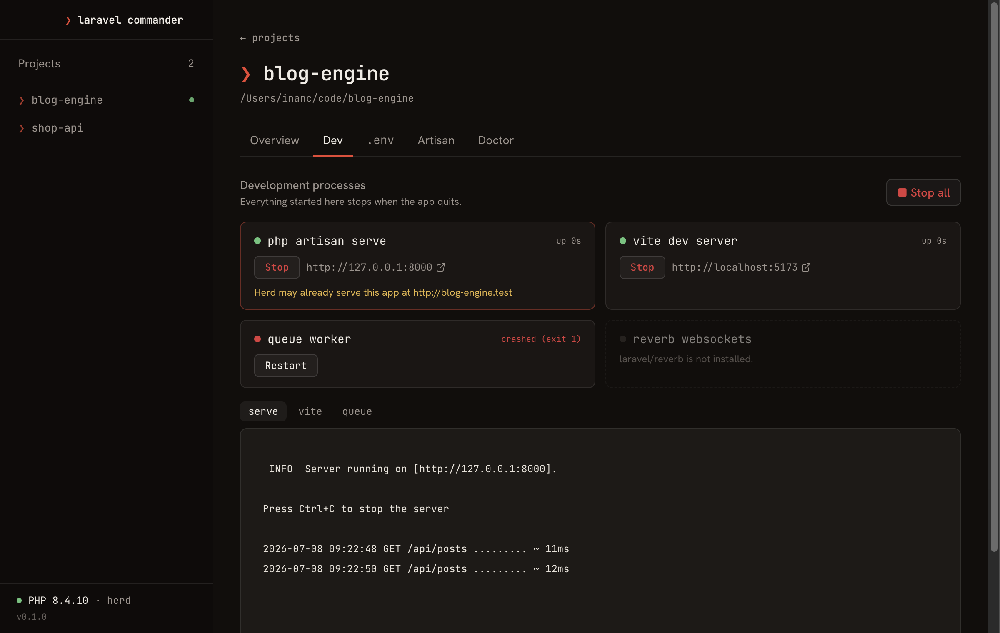
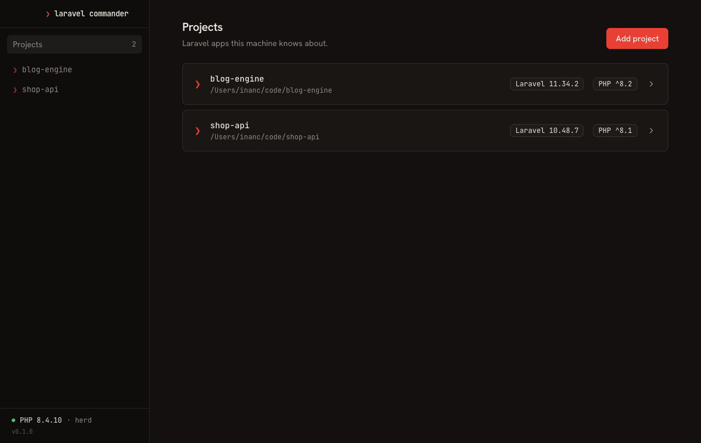
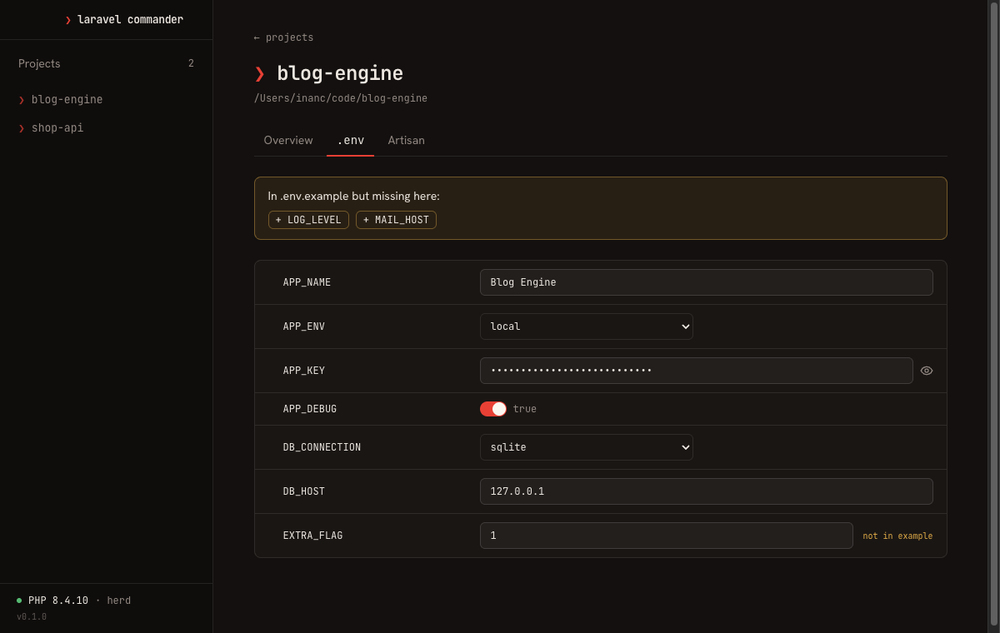
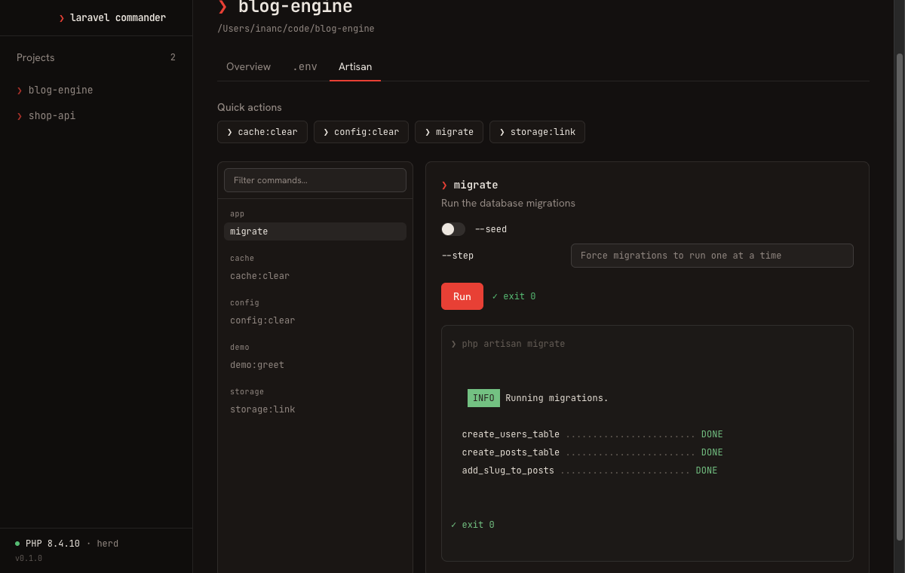

# Laravel Commander

> **Status: early development** — MVP features work; packaging and polish in progress.

An open-source desktop app for managing Laravel projects: add a project, edit
its `.env`, and run artisan commands — without touching the terminal.



## Features

- **Dev processes** — start your whole dev session with one click: `serve`,
  Vite, queue worker and Reverb run as supervised processes with live output,
  captured ports, crash detection and a guarantee that nothing outlives the app
- **Projects** — add a Laravel folder (validated: `artisan` + `laravel/framework`),
  see its Laravel version, PHP requirement and packages at a glance
- **.env editor** — comments, blank lines, key order and quote style survive
  every save; diff against `.env.example` with one-click add for missing keys;
  smart inputs (toggles for booleans, dropdowns for known keys, masked secrets)
- **Artisan panel** — full command catalog from `artisan list --format=json`,
  forms generated from each command's arguments and options, one-click quick
  actions, live ANSI-colored output with cancel support
- **PHP detection** — Herd, Homebrew, XAMPP and PATH fallback chain
- **Project Doctor** — 12 read-only consistency checks (PHP version vs
  composer constraint, empty APP_KEY, debug-on-in-production, stale config
  cache, broken storage link, missing SQLite file, pending migrations, …)
  with one-click fixes that never run without your say-so
- **Logs** — live-tailing log viewer with duplicate collapsing, level filters,
  collapsible stack traces and open-at-line in your editor; failed queue jobs
  with one-click retry/forget
- **Code X-ray** — searchable route table (middleware, color-coded methods,
  jump to controller) and a model explorer with attributes and relations
- **Glue** — make: generator with file previews, re-runnable artisan history,
  open the project in your editor, terminal or browser

| Projects                                   | .env editor                                     | Artisan panel                            |
| ------------------------------------------ | ----------------------------------------------- | ---------------------------------------- |
|  |  |  |

Built with Electron, Vue 3, TypeScript, Tailwind CSS and shadcn-vue.

## Install

Download the latest build for your platform from
[Releases](../../releases).

> **macOS note:** builds are not yet signed or notarized (that needs an Apple
> Developer account). Gatekeeper will block the first launch — clear the
> quarantine flag once:
>
> ```bash
> xattr -cr "/Applications/Laravel Commander.app"
> ```

## Development

You need Node.js 22+ and [pnpm](https://pnpm.io).

```bash
pnpm install
pnpm dev
```

## Layout

```
electron/main/       # Main process: window, services, IPC handlers
electron/preload/    # contextBridge API (the only place ipcRenderer is used)
src/                 # Renderer: Vue 3 pages, stores, components
shared/types.ts      # Typed IPC contract shared by main and renderer
```

All main↔renderer communication goes through the typed contract in
`shared/types.ts` — adding a channel there type-errors until both the preload
API and the main-process handler implement it.

## Scripts

| Command          | Description                              |
| ---------------- | ---------------------------------------- |
| `pnpm dev`       | Run in development with HMR              |
| `pnpm typecheck` | Typecheck main (node) and renderer (web) |
| `pnpm build`     | Typecheck + production build             |
| `pnpm lint`      | ESLint                                   |

## Contributing

See [CONTRIBUTING.md](CONTRIBUTING.md) — it includes a 60-second architecture
tour and the exact steps for adding a new IPC channel.

## License

[MIT](LICENSE)
